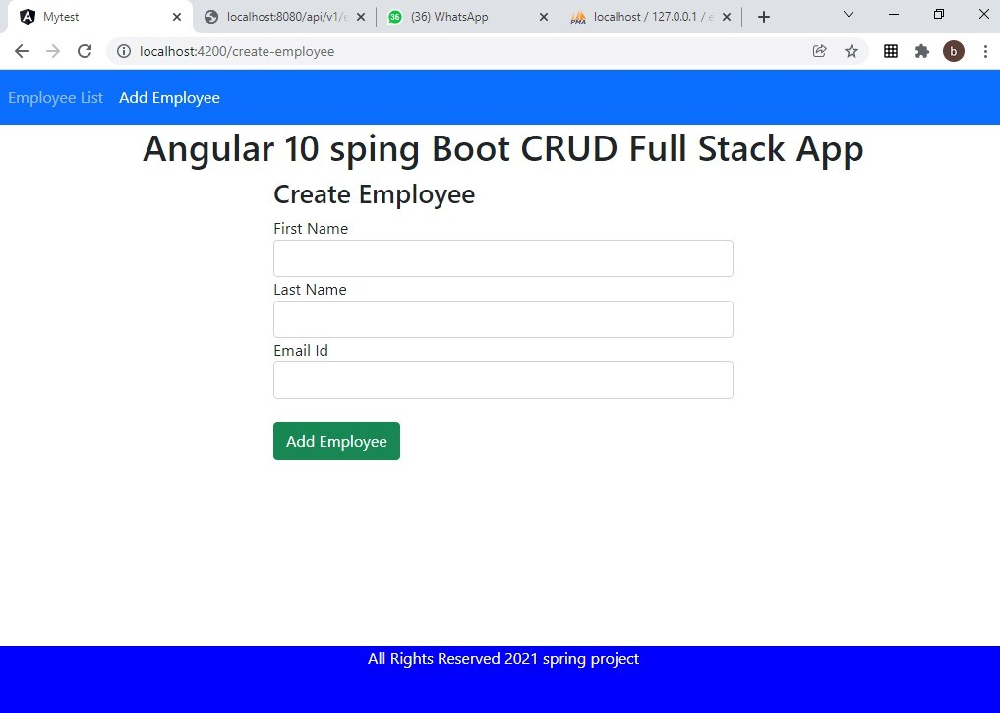
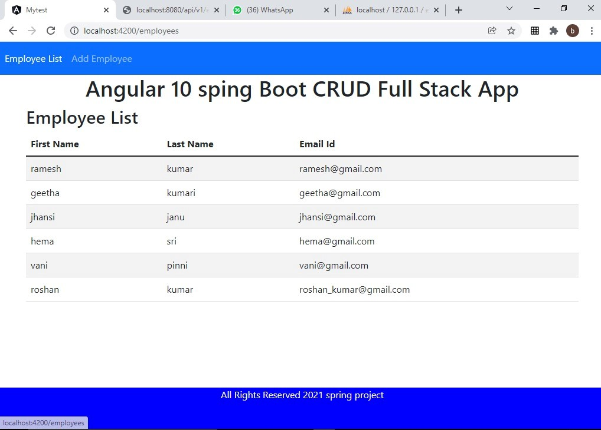

# OSD

first we need to install java, the need to download sts(Spring tool suit)

then install xampp software for mysql database.

open the xampp php myadmin and then create the database name employeemanagementsystem.

then open our application is sts we need to import the software and run the main file

by using spring boot app.
once the application is running our webservices or ready to use.

now to develop the single page application we are using anuglar.
we need to first install nodejs software
then install the angular using angular cli

now open our application mytest in cmd type the command

npm i 

the above command install all the packages.
once all the packages are installed successfully we need to start the server

ng serve

the above command start the angular server in port number 4200

now open the browser and type

localhost:4200

then our clien page will opens

SCREENSHOTS:

execution video:
<video src="https://github.com/Vyshnaviiii/OSD/blob/main/oosd%20execution.mp4" controls="controls" muted="muted" class="d-block rounded-bottom-2 width-fit" style="max-height:640px;">

  </video>
